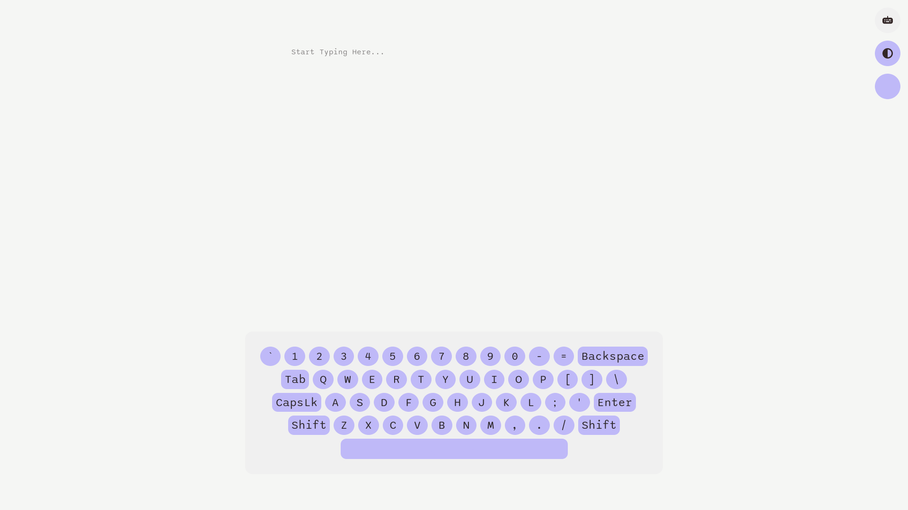
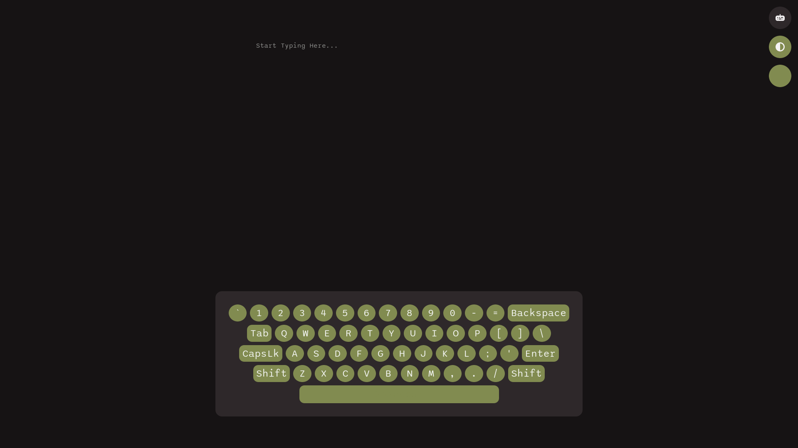

# Virtual Keyboard
Welcome to my Virtual Keyboard Project!

## Table of Contents
- [Overview](#overview)
    - [The Challenge](#the-challenge)
    - [Project Features](#project-features)
    - [Project Screenshots](#project-screenshots)
- [My Process](#my-process)
    - [Built With](#built-with)
    - [What I Learned](#what-i-learned)
    - [Useful Resources](#useful-resources)

## Overview
### The Challenge
My challenge was to build a fully functional virtual keyboard. I even went the extra mile and added a few other fun features :) (Note: It has been built with only Desktop in mind!)

### Project Features
The features included are:
- **Keyboard Toggle**: a toggle to show/hide the keyboard
- **Light/Dark Mode Toggle**: a toggle to switch b/w light and dark mode and have your preference stored locally
- **Keyboard Theme Color Picker**: change the color of the keyboard with the color picker 
- **Fully Functional Keys**: all the keys on display in the keyboard are fully functional; it does what it says on the tin!
- **Special Characters**: when either shift keys are enabled, special characters are revealed 
- **Draggable Keyboard**: you can move the keyboard around!

--- [LIVE WEBSITE]() ---

## Project Screenshots
 
LIGHT MODE PREVIEW

DARK MODE PREVIEW

## My Process

### Built With

- Love 💖
- Semantic HTML5 Markup
- CSS Flexbox
- CSS Custom Properties
- Vanilla JS

### What I Learned
Firstly, this project was way more ambitious than my to-do app! Getting the keyboard to its full functionality took a while; the two aspects I found challenging were displaying the special characters when either Shift key was enabled (I solved this one on my own!), and getting and setting the caret position for when using the Action keys or inputting text (I found a helpful resource for this one!). There was a lot of troubleshooting involved and there were points where I wanted to scrap certain functionalities for the sake of simplicity, but I'm never one to give up :) I've even gotten better at using SVGs! I read somewhere that using SVG icons is preferred and a11y friendly than compared to icon fonts so I made the switch to using SVG icons. 

### Useful Resources
- [Draggable Elements](https://webtips.dev/draggable-html-elements): used for making the keyboard draggable using just Vanilla JS
- [SVG Filters](https://codepen.io/sosuke/pen/Pjoqqp): since I did not use inline SVG icons, I had to change their color using the CSS filter property. This codepen helped me compute filters from corresponding hex codes 
- [Light/Dark Mode Toggle](https://www.youtube.com/watch?v=wodWDIdV9BY): Kevin "God of CSS" Powell's tutorial on creating a Light/Dark Mode Toggle
- [Change CSS :root Variables Using JS](https://stackoverflow.com/questions/37801882/how-to-change-css-root-color-variables-in-javascript): needed this so I can use the user's input from the color picker to change the color of the keyboard's keys
- [Styling input type="color"](https://codingartistweb.com/2021/09/styling-input-type-color-pure-css-tutorial/): had to make the color picker input look nice :)
- [Overflowing Text](https://developer.mozilla.org/en-US/docs/Web/CSS/CSS_text/Wrapping_breaking_text): breaking really big words in the textarea
- [Events Reference](https://developer.mozilla.org/en-US/docs/Web/Events): ref sheet of events
- [Textarea Tricks]( https://css-tricks.com/textarea-tricks/): styling the textarea to look nice :)
- [Merge/Flatten an Array of Arrays](https://stackoverflow.com/questions/10865025/merge-flatten-an-array-of-arrays): I needed this for when I created an array of arrays of the keys that needed their characters changed to show the special characters (rather than having to add in a separate class to each key in the html file and then using document.querySelectorAll to get them)
- [Inserting Text at Caret Position](https://www.bennadel.com/blog/4086-inserting-text-at-the-last-known-selection-caret-location-in-javascript.htm): this saved my LIFE!
